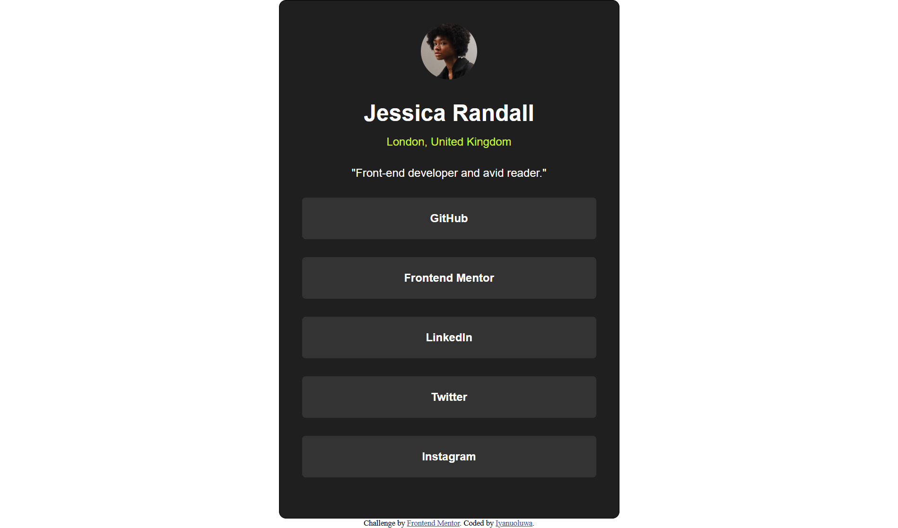

# Frontend Mentor - Social links profile solution

This is a solution to the [Social links profile challenge on Frontend Mentor](https://www.frontendmentor.io/challenges/social-links-profile-UG32l9m6dQ). Frontend Mentor challenges help you improve your coding skills by building realistic projects. 

## Table of contents

- [Overview](#overview)
  - [The challenge](#the-challenge)
  - [Screenshot](#screenshot)
  - [Links](#links)
- [My process](#my-process)
  - [Built with](#built-with)
  - [What I learned](#what-i-learned)
  - [AI Collaboration](#ai-collaboration)
- [Author](#author)


## Overview

### The challenge

Users should be able to:

- See hover and focus states for all interactive elements on the page

### Screenshot




### Links

- Solution URL: [Add solution URL here](https://your-solution-url.com)
- Live Site URL: [Add live site URL here](https://your-live-site-url.com)

## My process

### Built with

- Semantic HTML5 markup
- CSS custom properties
- Flexbox
-- Mobile-first workflow


### What I learned
I learnt how to use clamp for fluid, responsive sizing of text, spacing, and the avatar without needing media query breakpoints:

```html
<h1>Some HTML code I'm proud of</h1>
```
```css
.avatar{
    border-radius: 50%;
    width: clamp(4rem, 5vw + 1rem, 5rem);
   height: clamp(4rem, 5vw + 1rem, 5rem);
   margin-bottom: max(0.7rem, 2vw);
   object-fit: cover;
}
```


### AI Collaboration
I used AI (Claude, ChatGPT) for debugging and brainshtorming solution, this helped an assistant to learning the symtax properly

## Author

- Frontend Mentor - [@yourusername](https://www.frontendmentor.io/profile/iyanu22)
